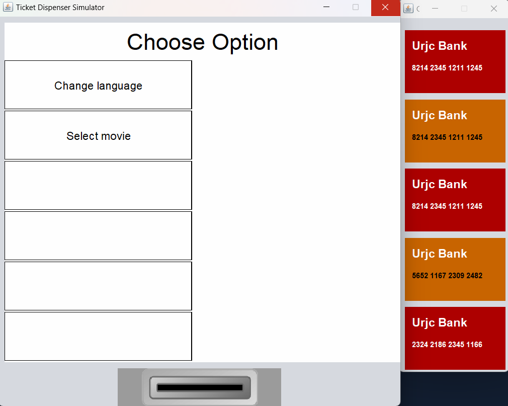
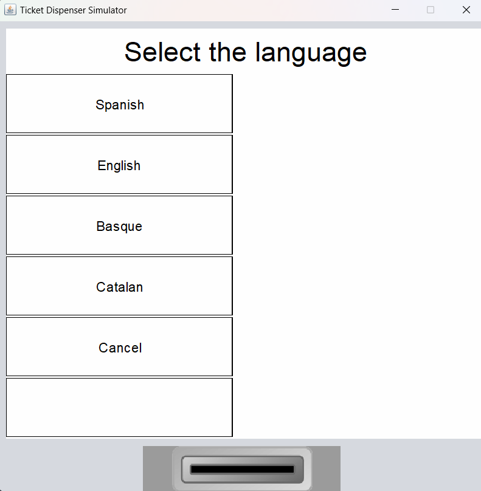
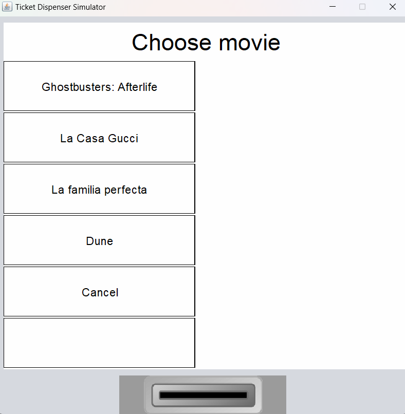
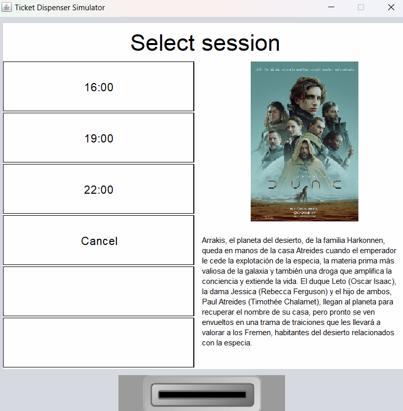
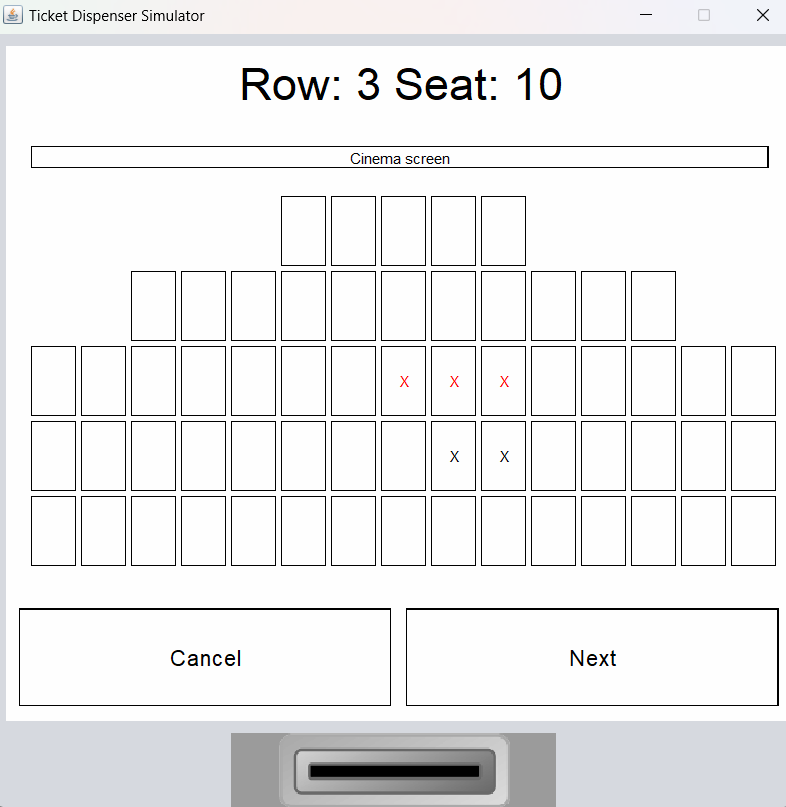
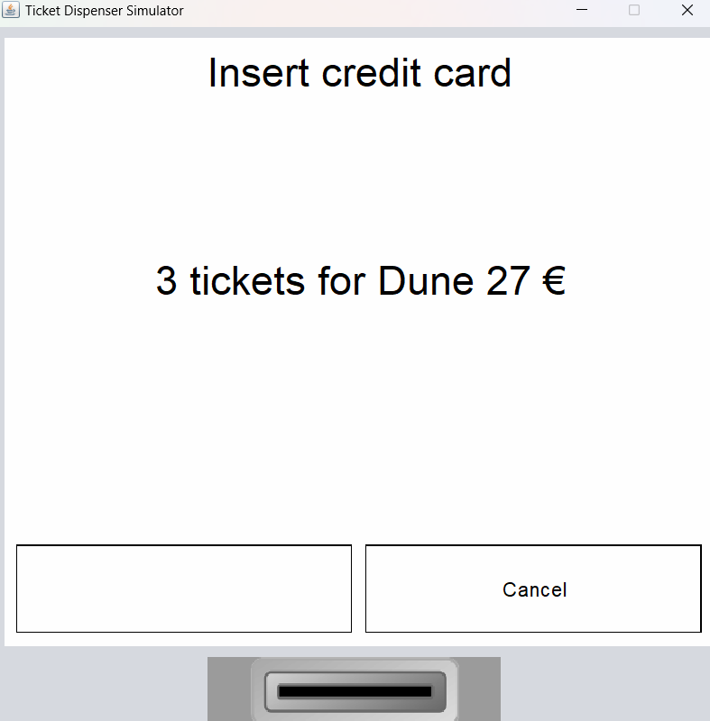
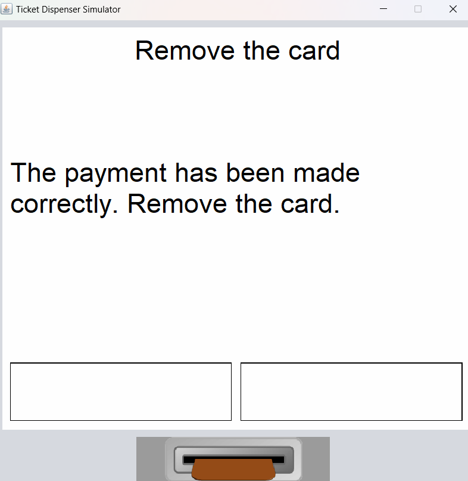
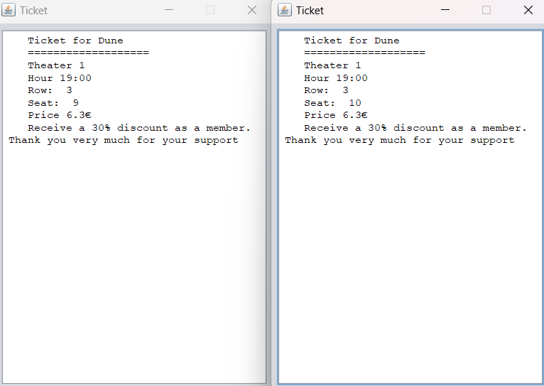

# Cinema-Ticket-Machine

This project is a machine to sell movie tickets. It has a front-end that emulates a real ticket vending machine, and gives you different credits cards to do the payment.

## Features

* It reads from a file the distribution of the movie theaters.
* It reads from file the movie info of the showtime.
* It reads from file a list of members of the cinema that has a disccount in their purchases.
* The language can be switched between english, spanish, vasque and catalan.
* You can select the seats in the theater.
* You can select the movie that you want to see.
* You can select the session.
* You can pay the tickets.
* It gives you the tickets in a .txt file.
* It saves the state of the cinema in every purchase.
* If there was a problem and the machine turned off you can recover the state of the cinema.
* You can cancell the purchase of the tickets when you want.
* If you dont interact with the machine in 30 seconds, it cancells the purchase and go to the initial screen.
* If you dont retire the credit card in 30 seconds, it saves the card so you dont lose it.

## Images

This is the initial screen

This is the language selection

This is the movie selection

This is the session selection

This is the seat selection

This is the payment screen

This is the member disccount

This is the message to remove the card

This are the printed tickets

